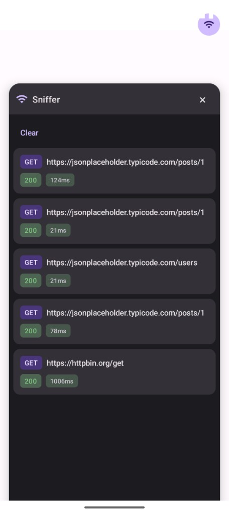
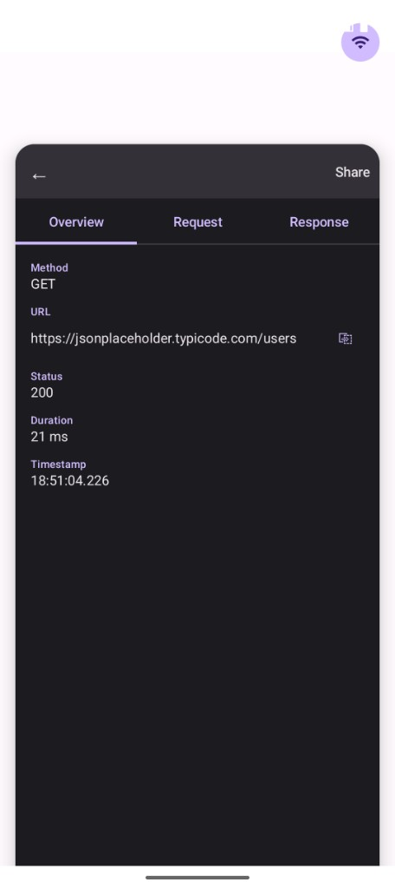
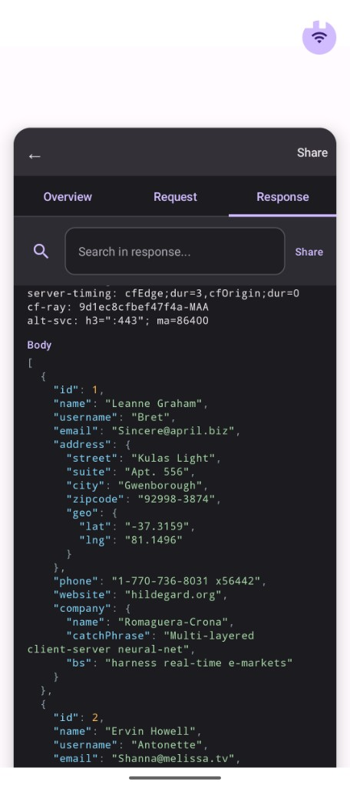

# Sniffer

Open-source Android debugging library: a floating overlay to inspect HTTP traffic from your app in real time. No proxy, no external tools—tap the bubble to see requests and responses.

- **License:** [GPL-3.0](https://www.gnu.org/licenses/gpl-3.0.html)
- **Repo:** [github.com/debz-g/sniffer](https://github.com/debz-g/sniffer)

<p align="center">
  
  
  
</p>

---

## Install

Add the dependency (Maven Central):

```kotlin
dependencies {
    implementation("io.github.debz-g:sniffer:1.0.0")
}
```

Ensure your project has `mavenCentral()` in its repositories (default in most Android projects).

---

## Setup

1. **Initialize** in your `Application`:

   ```kotlin
   class MyApp : Application() {
       override fun onCreate() {
           super.onCreate()
           Sniffer.init(this)
       }
   }
   ```

2. **Add the interceptor** to the HTTP client you use for API calls (see below).

The overlay only runs in **debuggable** builds. In release builds, Sniffer does nothing.

---

## Usage

### With Retrofit

Retrofit uses OkHttp. Add Sniffer’s interceptor when you build the `OkHttpClient`:

```kotlin
val okHttpClient = OkHttpClient.Builder()
    .addInterceptor(Sniffer.interceptor())
    .build()

val retrofit = Retrofit.Builder()
    .baseUrl("https://api.example.com/")
    .client(okHttpClient)
    .addConverterFactory(GsonConverterFactory.create())
    .build()

val api = retrofit.create(MyApi::class.java)
```

All requests made with this `Retrofit` instance will appear in the Sniffer overlay.

### With Ktor

Use the **OkHttp** engine and add Sniffer’s interceptor in the engine config:

```kotlin
import io.ktor.client.*
import io.ktor.client.engine.okhttp.*
import dev.sniffer.Sniffer

val client = HttpClient(OkHttp) {
    engine {
        addInterceptor(Sniffer.interceptor())
    }
}
```

Use this `HttpClient` for your requests; they will show up in Sniffer.

---

## How it works

- A **draggable bubble** appears on screen; **tap** to open the inspector, **drag** to move it.
- The inspector lists recent network calls. Tap one to see details (URL, headers, request/response body).
- No special permission is required: the overlay is injected into your app’s window.
- You can copy URLs, share as cURL, or search inside response bodies.

---

## Contributing

Contributions are welcome. By contributing, you agree that your contributions will be licensed under the same license as the project (GPL-3.0).

1. **Fork** the repository and create a branch from `main` for your change.
2. **Make your changes** and ensure they align with the existing code style (Kotlin, Compose).
3. **Test** on a debug build (overlay + inspector).
4. **Open a Pull Request** against `main` with a clear description of the change.
5. **Discussion**: for larger changes or new features, open an Issue first to align with maintainers.

Please do not commit secrets (API keys, tokens, signing passwords). Keep credentials in local `gradle.properties` or environment variables, and do not add them to the repository.
